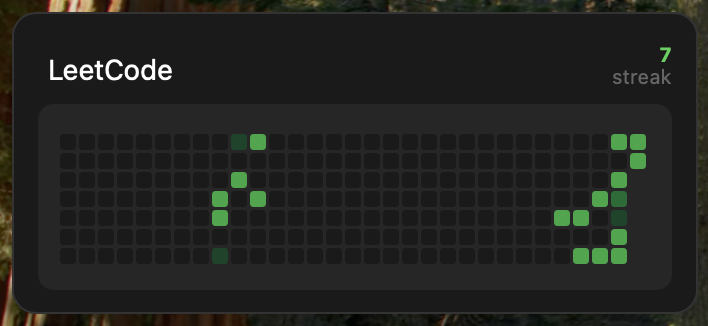

# LeetCode Activity Widget

A sleek Übersicht widget that displays your LeetCode submission calendar and current streak with a clean contribution graph design. Keep your coding consistency visible on your desktop and stay motivated with your daily progress.



## Features

- 📅 **Submission Calendar**: Visual representation of your daily LeetCode submissions over the past year
- 🔥 **Current Streak**: Shows your current consecutive submission streak to keep you motivated
- 🎨 **Clean Design**: Familiar contribution graph aesthetics with color-coded activity levels
- ⚡ **Auto-refresh**: Updates every hour to keep your stats current
- 🌙 **Dark Theme**: Matches macOS dark mode perfectly
- 💪 **Daily Motivation**: Having your progress visible on your desktop encourages consistent practice

## Installation

1. Install [Übersicht](http://tracesof.net/uebersicht/) if you haven't already
2. Download the `leetcode.jsx` file from this repository
3. Move the `leetcode.jsx` file to your Übersicht widgets folder (usually `~/Library/Application Support/Übersicht/widgets/`)
4. Configure your LeetCode username (see Configuration section below)

## Configuration

Open `leetcode.jsx` and modify the following settings at the top of the file:

```javascript
// --- USER SETTINGS ---
const leetcodeUsername = "your-username-here"; // Replace with your actual LeetCode username

// Widget dimensions and position
const widgetWidth = 317;
const widgetHeight = 125;
const widgetLeft = 15;
const widgetTop = 335; // Adjust position on your desktop
```

### Positioning

- `widgetLeft`: Distance from the left edge of your screen (in pixels)
- `widgetTop`: Distance from the top edge of your screen (in pixels)
- `widgetWidth` & `widgetHeight`: Widget dimensions (modify if needed)

## API Information

This widget uses the [LeetCode Stats API](https://leetcode-stats-api.herokuapp.com) to fetch your submission data. The API has rate limits, so the widget refreshes every hour to avoid hitting these limits.

### Rate Limits

- The widget refreshes every hour (3,600,000 milliseconds)
- If you encounter rate limit errors, the widget will display an error message and retry on the next refresh cycle

## Color Coding

The calendar uses a clean color-coding system:
- **Dark Gray** (`#1a1a1a`): No submissions
- **Dark Green** (`#0e4429`): 1 submission
- **Medium Green** (`#006d32`): 2 submissions  
- **Bright Green** (`#26a641`): 3+ submissions
- **Brightest Green** (`#39d353`): High activity

## Troubleshooting

### Widget not showing data
1. Verify your LeetCode username is correct and publicly accessible
2. Check the browser console in Übersicht for error messages
3. Ensure your LeetCode profile is public (the API cannot access private profiles)

### Rate limit errors
- Wait a few hours for the rate limit to reset
- The widget will automatically retry on the next refresh cycle

### Positioning issues
- Adjust `widgetLeft` and `widgetTop` values in the configuration section
- Restart Übersicht after making changes

## Customization

### Changing Colors
Modify the `getColor()` function to use different colors:

```javascript
const getColor = (count) => {
  if (count === 0) return "#your-color";
  // ... customize other levels
};
```

### Adjusting Refresh Rate
Change the `refreshFrequency` value (in milliseconds):

```javascript
export const refreshFrequency = 3600000; // 1 hour = 3,600,000ms
```

**Note**: Don't set this too low to avoid hitting API rate limits.

## Contributing

Contributions are welcome! Please feel free to submit a Pull Request. For major changes, please open an issue first to discuss what you would like to change.

## License

This project is licensed under the MIT License - see the [LICENSE](LICENSE) file for details.

## Acknowledgments

- [Übersicht](http://tracesof.net/uebersicht/) for the desktop widget framework
- [LeetCode Stats API](https://leetcode-stats-api.herokuapp.com) for providing the data

## Support

If you encounter any issues or have questions:

1. Check the Issues page for similar problems
2. Create a new issue with detailed information about your problem
3. Include your macOS version and Übersicht version

---

⭐ If you find this widget useful, please consider giving it a star!
